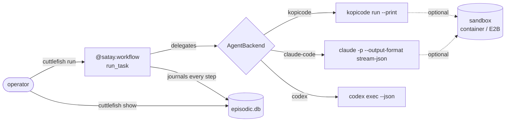
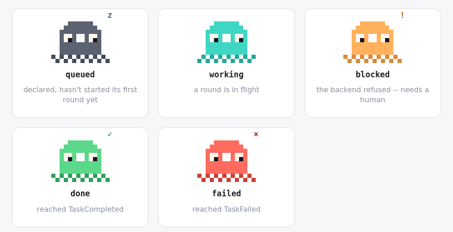

# cuttlefish-crew

A fleet manager for small teams of coding agents, across many software
projects at once. Give a project's crew a task in plain language; each agent
hands the actual coding to a pluggable backend
([kopicode](https://github.com/leejianrong/kopicode), headless Claude Code,
or headless Codex), and everything that happens lands in one readable journal
you can watch from a dashboard.

> **Status**: pre-1.0 and single-operator (one shared password, no per-user
> accounts). [`CLAUDE.md`](CLAUDE.md) lists
> what is shipped and the gaps that are known and accepted.



In the dashboard every role is a small sprite whose pose is its status:



The core loop is a durable [satay](https://github.com/leejianrong/satay-runtime)
workflow. If the fleet daemon (`cuttlefish serve`) is killed mid-run,
restarting it resumes each project's in-flight team: same team id, a
`TeamResumed` marker in the journal, no finished round re-run (the round that
was mid-flight starts over). A killed one-shot `cuttlefish run`/`run-team` does
**not** resume; rerunning it starts a new task.

## Prerequisites

| You need | For |
|---|---|
| Python 3.12+ and [uv](https://docs.astral.sh/uv/) | everything |
| One coding-agent CLI on `PATH`, logged in or keyed: [`kopicode`](https://github.com/leejianrong/kopicode#readme) (the default; needs `OPENROUTER_API_KEY` or `ANTHROPIC_API_KEY`), `claude`, or `codex` (after `codex login`) | delegating work |
| `OPENROUTER_API_KEY` (optional) | cuttlefish's own summarising calls; see below |
| Node.js and npm | only for the dashboard (`make demo`) |
| Docker | only for `CUTTLEFISH_SANDBOX=container` |

cuttlefish's own model calls are used for one thing, summarising a role's
working memory when it crosses its token budget. By default they go through
OpenRouter, but only when a summary is actually due: a run that never reaches
its budget needs no key, so a Claude Code or Codex user can start without one.
If a summary is due and `OPENROUTER_API_KEY` is unset, the run fails with a
message saying so; `CUTTLEFISH_LLM_PROVIDER=replay` instead makes those
summaries a placeholder. The chosen agent CLI is checked before any task is
accepted.

## Quick start

```bash
git clone https://github.com/leejianrong/cuttlefish-crew.git
cd cuttlefish-crew
uv sync
```

Not sure your setup is right? `uv run cuttlefish init` checks the agent CLI
and its login, registers the repo as a project with a `builder` and a
`reviewer` role (re-running is safe), and prints the exact next command.

Run one task against the repo you are standing in (`--root` picks another):

```bash
export CUTTLEFISH_AGENT_BACKEND=codex     # or kopicode (default), claude-code
uv run cuttlefish run "add a .gitignore entry for build artifacts"
uv run cuttlefish show <task-id>          # the id `run` prints
```

State is written to `.cuttlefish/` and `.satay/` in the directory you run
from (both are in this repo's `.gitignore`; add them to yours).

Or bring up the dashboard:

```bash
make demo
```

This builds the dashboard once, then runs `cuttlefish serve` alone: one
process serves the API and the UI, and prints a URL plus a token to paste
into the connect screen. No daemon yet? The connect screen also links to a
sprite gallery that needs no connection.

## Usage

Let a delegation run named shell commands (default: none; only edits inside
`--root`):

```bash
uv run cuttlefish run "run the test suite" --allow "python -m pytest"
```

Run a crew of named roles on one project, then watch it in the dashboard:

```bash
uv run cuttlefish projects add --name demo --root /path/to/repo \
  --role builder --role reviewer --allow "python -m pytest"
make demo                   # serves the dashboard; click Start on the project card
```

Redirect a running task, or make it wait for your sign-off. Both take effect
at the boundary between delegation rounds, never mid-flight:

```bash
uv run cuttlefish run --steerable "add a .gitignore entry"
uv run cuttlefish steer <task-id> "actually add a .dockerignore instead"   # from a second terminal

uv run cuttlefish run --require-approval "add a .gitignore entry"
uv run cuttlefish approve <task-id>          # or: --reject "use .dockerignore"
```

Two roles on one kopicode-backed project run one at a time, not
concurrently: kopicode locks a working tree per session.

Everything else (project-scoped secrets, container/E2B sandboxes, token and
cost ceilings, Tailscale access, the MCP server, every flag) is in the
[CLI reference](https://leejianrong.github.io/cuttlefish-crew/docs/cli-reference/).

## Configuration

| Variable | Default | What it does |
|---|---|---|
| `CUTTLEFISH_AGENT_BACKEND` | `kopicode` | `kopicode`, `claude-code`, or `codex`; one choice per process. |
| `CUTTLEFISH_LLM_PROVIDER` | `openrouter` | cuttlefish's own summarising calls: `openrouter`, `claude`, or `replay` (no key, placeholder summaries). |
| `CUTTLEFISH_SANDBOX` | `none` | `none`, `container` (local Docker), or `e2b`. |
| `CUTTLEFISH_SECRETS_KEY` | unset | Turns on the encrypted, project-scoped secrets store. |

Binary paths, serve/MCP settings and the rest are in the
[configuration table](https://leejianrong.github.io/cuttlefish-crew/docs/cli-reference/#configuration).
A `Dockerfile` and `fly.toml.example` exist for Fly.io hosting; they have been
built and run locally but never deployed (ADR-0015).

## Documentation

[Docs site](https://leejianrong.github.io/cuttlefish-crew/docs/) (quickstart,
CLI reference, architecture) · [`docs/PLAN.md`](docs/PLAN.md) (where this is
headed) · [`docs/adr/`](docs/adr/) (why each decision was made) ·
[`docs/research/`](docs/research/) (competitor comparison).

## Contributing

There is no `CONTRIBUTING.md`; [`CLAUDE.md`](CLAUDE.md) is the contributor
guide (toolchain, branch and PR workflow, and the architectural boundaries).
`main` is PR-only and `make ci` must pass. Issues and questions:
[GitHub issues](https://github.com/leejianrong/cuttlefish-crew/issues).

## The rest of the suite

- [kopicode](https://github.com/leejianrong/kopicode): the reference coding
  specialist this project delegates to.
- [satay-runtime](https://github.com/leejianrong/satay-runtime): the durable
  runtime this project's core loop is built on.
- [sibei-flow](https://github.com/leejianrong/sibei-flow): auto-heals broken
  data pipelines; its hand-rolled transcript is the lesson this project's
  journal is built to avoid repeating.
- [tingkat](https://github.com/leejianrong/tingkat): a multi-LoRA routing
  benchmark.

## Licence

Apache-2.0. See [LICENSE](LICENSE).
