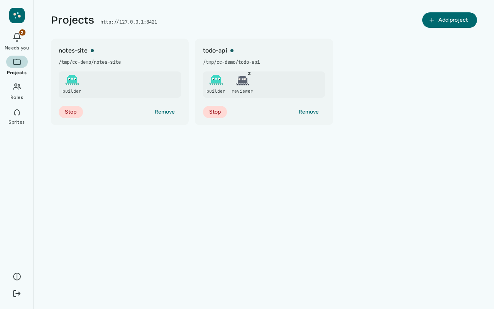
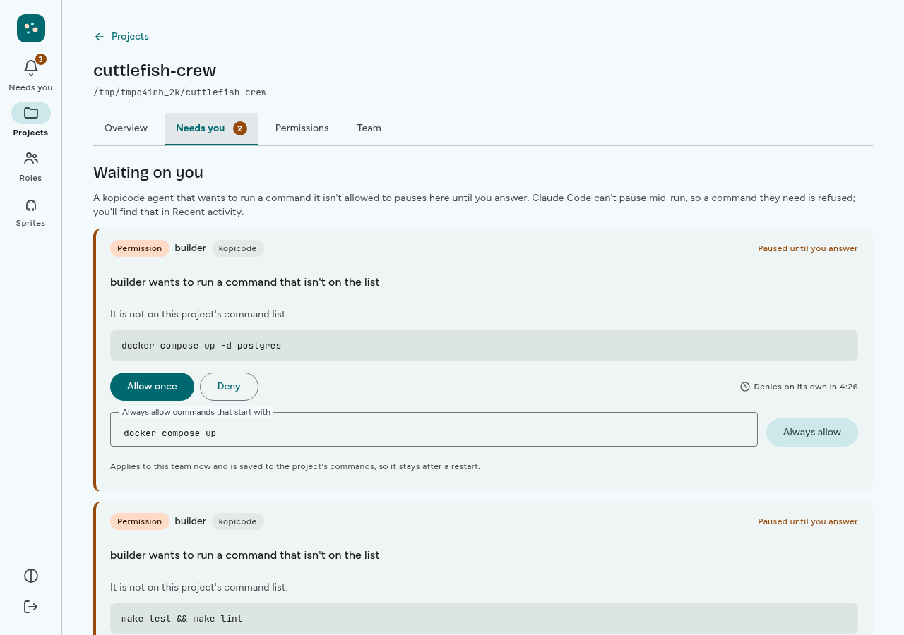
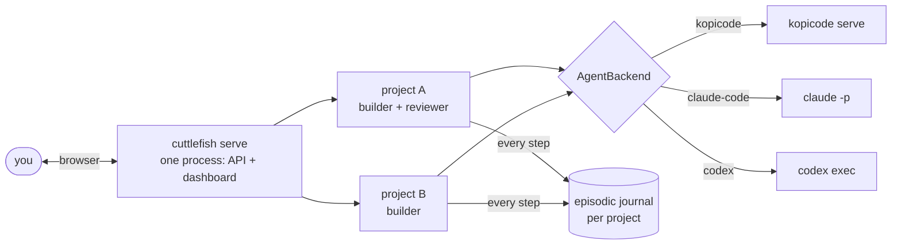

# cuttlefish-crew

A fleet manager for small teams of coding agents, across many software
projects at once. Register your repos, give each project's crew a task in plain
language, and watch every team from one dashboard. Each agent hands the actual
coding to a pluggable backend
([kopicode](https://github.com/leejianrong/kopicode), headless Claude Code, or
headless Codex), and everything that happens lands in one readable journal.



When an agent wants to run a command you have not approved, it stops and waits
for you. You answer from the dashboard, and the agent carries on:



> **Status**: pre-1.0 and single-operator (one shared password, no per-user
> accounts). [`AGENTS.md`](AGENTS.md) and
> [`agent_docs/known-gaps.md`](agent_docs/known-gaps.md) list what is shipped
> and the gaps that are known and accepted.



The core loop is a durable [satay](https://github.com/leejianrong/satay-runtime)
workflow. If the fleet daemon is killed mid-run, restarting it resumes each
project's in-flight team: same team id, a `TeamResumed` marker in the journal,
no finished round re-run (the round that was mid-flight starts over). A killed
one-shot `cuttlefish run`/`run-team` is not resumed automatically; rerunning it
warns about the unfinished run, and `--resume <id>` with the original arguments
continues it.

## Prerequisites

| You need | For |
|---|---|
| Python 3.12+ and [uv](https://docs.astral.sh/uv/) | everything |
| Node.js and npm | the dashboard (`make demo` builds it once) |
| One coding-agent CLI on `PATH`, logged in or keyed: [`kopicode`](https://github.com/leejianrong/kopicode#readme) (the default; v0.3.0 or later, needs `OPENROUTER_API_KEY` or `ANTHROPIC_API_KEY`), `claude`, or `codex` (after `codex login`) | delegating work |
| `OPENROUTER_API_KEY` (optional) | cuttlefish's own summarising calls; see below |
| Docker | only for `CUTTLEFISH_SANDBOX=container` |

Install kopicode with
`curl -fsSL https://raw.githubusercontent.com/leejianrong/kopicode/main/scripts/install.sh | sh`
(it lands in `~/.local/bin`). kopicode reads its key from the environment only,
so `export OPENROUTER_API_KEY=...` in the shell you start cuttlefish from.

cuttlefish's own model calls are used for one thing, summarising a role's
working memory when it crosses its token budget. By default they go through
OpenRouter, but only when a summary is actually due, so a run that never
reaches its budget needs no key. If a summary is due and `OPENROUTER_API_KEY` is
unset, the run fails with a message saying so; `CUTTLEFISH_LLM_PROVIDER=replay`
makes those summaries a placeholder instead.

## Try it: two projects, one dashboard

About ten minutes. Agents spend your model credit, usually cents for the tasks
below.

**1. Install and make two practice repos.**

```bash
git clone https://github.com/leejianrong/cuttlefish-crew.git
cd cuttlefish-crew
uv sync

mkdir -p ~/crew-demo && cd ~/crew-demo
for p in todo-api notes-site; do mkdir $p && git -C $p init -q -b main; printf '.cuttlefish/\n.satay/\n' > $p/.gitignore; done
printf 'class TodoList:\n    def __init__(self):\n        self.items = []\n\n    def add(self, item):\n        self.items.append(item)\n' > todo-api/todo.py
printf '<!doctype html>\n<title>Notes</title>\n<h1>Notes</h1>\n' > notes-site/index.html
for p in todo-api notes-site; do git -C $p add -A && git -C $p -c user.name=demo -c user.email=demo@example.com commit -qm init; done
cd -
```

**2. Start the dashboard.**

```bash
export OPENROUTER_API_KEY=...        # or the key your agent CLI uses
make demo
```

This builds the dashboard once, then runs `cuttlefish serve`: one process
serving the API and the UI. It prints a URL and a token. Open the URL, check
that the address box on the Connect screen matches it (it starts as
`http://127.0.0.1:8420`), and paste the token. No daemon yet? The Connect
screen also links to a sprite gallery that needs no connection. The daemon's
log prints in this terminal and is always written to
`~/.cuttlefish/logs/cuttlefish.log`; `make demo LOG=1` also copies it to
`/tmp/cuttlefish.log`. Ctrl-C stops it cleanly.

**3. Add both projects.** On Projects choose **Add project**, pick
`~/crew-demo/todo-api` in the folder picker, keep the Builder + reviewer team,
and add it. Repeat for `~/crew-demo/notes-site` with the Solo builder team. (From
a terminal, `uv run cuttlefish projects add --name todo-api --root ~/crew-demo/todo-api`
does the same; add `--max-tokens 200000` to cap a project's token use.)

**4. Start both crews.** Open **todo-api**, give the builder a task, and press
**Start team**:

> Add a remove(item) method to TodoList in todo.py, and a test for it. Then run
> `uname -a` and tell me what it prints.

Go back to Projects, open **notes-site**, and start its builder on:

> Add a short About section to index.html.

The two teams run side by side; each agent is a small sprite whose pose is its
status. Roles inside one kopicode project run one at a time, because kopicode
locks a working tree per session.

**5. Answer what needs you.** The bell in the rail and the **Needs you** tab show
a count. A command that is not on the project's list pauses that agent until you
choose **Allow once**, **Always allow** (the start of the command, saved to the
project's commands), or **Deny**. Left alone, it denies itself after ten minutes. With
kopicode v0.4.0 or later, a question the agent asks you shows up here too, with a box for your answer.

**6. Steer, review, stop.** While a role is running you can send it a
redirect; it lands at the next round boundary, not mid-flight. Turn on **Approve
each round before it ends** before starting to review a round first. **Stop team**
asks the agent to finish its current step and stop. When it is done, see what the
crew did:

```bash
git -C ~/crew-demo/todo-api diff
```

The Activity log on each project, and `uv run cuttlefish show <team-id>`, replay
every step from the journal.

## Usage from the command line

Run one task against the repo you are standing in (`--root` picks another):

```bash
export CUTTLEFISH_AGENT_BACKEND=codex     # or kopicode (default), claude-code
uv run cuttlefish run "add a .gitignore entry for build artifacts"
uv run cuttlefish show <task-id>          # the id `run` prints
```

State is written to `.cuttlefish/` and `.satay/` in the directory you run from
(both are in this repo's `.gitignore`; add them to yours). Not sure your setup is
right? `uv run cuttlefish init` checks the agent CLI and its login, registers the
repo as a project, and prints the next command.

Let a delegation run named shell commands (default: none; only edits inside
`--root`), or run a crew of named roles:

```bash
uv run cuttlefish run "run the test suite" --allow "python -m pytest"
uv run cuttlefish run-team --role builder:"implement the login form" --role reviewer:"review the last commit"
uv run cuttlefish run --steerable "add a .gitignore entry"     # then: cuttlefish steer <task-id> "..."
uv run cuttlefish run --require-approval "add a .gitignore entry"   # then: cuttlefish approve <task-id>
```

`cuttlefish run` and `run-team` have no inbox: a command nothing approves is
refused there rather than waiting. Only a team started from the dashboard can ask
you, and only a kopicode agent can pause for it (Claude Code and Codex refuse).
Everything else (project-scoped secrets, container/E2B sandboxes, token ceilings,
Tailscale access, the MCP server, every flag) is in the
[CLI reference](https://leejianrong.github.io/cuttlefish-crew/docs/cli-reference/).

## Configuration

| Variable | Default | What it does |
|---|---|---|
| `CUTTLEFISH_AGENT_BACKEND` | `kopicode` | `kopicode`, `claude-code`, or `codex`; one choice per process. |
| `CUTTLEFISH_LLM_PROVIDER` | `openrouter` | cuttlefish's own summarising calls: `openrouter`, `claude`, or `replay` (no key, placeholder summaries). |
| `CUTTLEFISH_LLM_MODEL` | `qwen/qwen3-30b-a3b-instruct-2507` | The OpenRouter model for cuttlefish's own summaries (handovers). A small non-reasoning model on purpose (about $0.003 a summary, and it cannot spend its output cap thinking); any OpenRouter model id works. The provider reports each call's cost, shown on the Summary rows of the activity log. |
| `CUTTLEFISH_CODEX_MODEL`, `CUTTLEFISH_CODEX_EFFORT` | unset | The model (`--model`) and reasoning effort (`minimal`, `low`, `medium`, `high`) for the Codex backend, so a team can use a small model on your ChatGPT subscription without editing `~/.codex/config.toml`. Unset leaves Codex's own configuration alone. A daemon run as another HOME also needs `CODEX_HOME` pointing at the Codex login, named in `CUTTLEFISH_AGENT_ENV_PASSTHROUGH`. |
| `CUTTLEFISH_SANDBOX` | `none` | `none`, `container` (local Docker), or `e2b`. |
| `CUTTLEFISH_REQUEST_WINDOW` | `600` | Seconds you have to answer a Needs-you request before it is denied, 10 to 86400. kopicode v0.3.0 or later honours it; an older kopicode denies after 60 seconds, so there you get 45. |
| `CUTTLEFISH_AGENT_ENV_PASSTHROUGH` | unset | Names (comma-separated, `*` ends a prefix) to pass to agents on top of the allowlist: agents get `HOME`, `LANG`, proxies, toolchain paths and their own credentials, not the daemon's whole environment. `cuttlefish doctor` lists what is withheld. |
| `CUTTLEFISH_KEEP_WINDOWS_PATH` | unset | `1` keeps WSL's `/mnt/...` entries on an agent's `PATH` (dropped by default). |
| `CUTTLEFISH_PREPARE_TIMEOUT` | `900` | Seconds one dependency-install step may run before it is killed. |
| `CUTTLEFISH_LOG_LEVEL` | `INFO` | How much `cuttlefish serve` logs, to the terminal and to `~/.cuttlefish/logs/cuttlefish.log` (rotating): `DEBUG` adds every tool call and permission decision. |
| `CUTTLEFISH_STUCK_THRESHOLD` | `5` | How many shell commands in a row may fail on the project's environment (`No module named`, `command not found`, `ENOENT`, `Cannot find module`, ...) before cuttlefish stops a kopicode agent instead of letting it run to `max_turns`. `0` turns it off. Claude Code and Codex are not watched. |
| `CUTTLEFISH_MAX_TURNS` | `100` | Turns a kopicode round may take before it stops (kopicode v0.4.0 or later; an older one keeps its own 20). These are the daemon's defaults: a project, and a role in it, can set its own in the dashboard (Team tab) or over HTTP (`GET /api/limits`, `PATCH /api/projects/{id}/limits`); role over project over this variable over the built-in value. |
| `CUTTLEFISH_SESSION_TOKEN_BUDGET` | `5000000` | Tokens one kopicode round may spend, counting the history resent on each request; `0` is unbounded. |
| `CUTTLEFISH_MAX_CONTINUATIONS` | `20` | How many times a team role carries on by itself, with a fresh session and the latest handover, after a round stops on turns, tokens or time, or after a command was refused, and was not stuck. `0` makes that stop a failed round, as before. |
| `CUTTLEFISH_ROUND_TIMEOUT` | `7200` | Seconds one kopicode round may run before cuttlefish cancels it; the role then continues from the handover like any other round that ran out of room. `0` is no limit. A round waiting on you in Needs you counts. |
| `CUTTLEFISH_MAX_IDLE_ROUNDS` | `3` | How many rounds in a row may end (out of room, or on a refused command) without changing a file before the role is held and a Needs-you card says so. A steer starts the count again. `0` turns it off. |
| `CUTTLEFISH_CONTEXT_LIMIT_PERCENT` | `75` | How full a kopicode round's context may get, as a percentage of the model's window, before cuttlefish ends the round and the role continues from the handover with a fresh context. Needs kopicode v0.4.0 and a model whose window kopicode knows; otherwise nothing happens. `0` turns it off; above `95` counts as `95`. |
| `CUTTLEFISH_SECRETS_KEY` | unset | Turns on the encrypted, project-scoped secrets store. Must be a Fernet key. |

Binary paths, serve/MCP settings and the rest are in the
[configuration table](https://leejianrong.github.io/cuttlefish-crew/docs/cli-reference/#configuration).
A `Dockerfile` and `fly.toml.example` exist for Fly.io hosting; they have been
built and run locally but never deployed (ADR-0015).

Known limits worth knowing before you spend money: the dashboard shows tokens but
not dollars for kopicode (kopicode reports no cost yet, so a dollar limit cannot
stop it, while a token limit does), and **Stop** takes effect when the current
round ends, which can be minutes.

## Documentation

[Docs site](https://leejianrong.github.io/cuttlefish-crew/docs/) (quickstart,
CLI reference, architecture) · [`docs/PLAN.md`](docs/PLAN.md) (where this is
headed) · [`docs/adr/`](docs/adr/) (why each decision was made) ·
[`docs/research/`](docs/research/) (competitor comparison).

## Contributing

There is no `CONTRIBUTING.md`; [`AGENTS.md`](AGENTS.md) is the contributor guide
(toolchain, branch and PR workflow, and the architectural boundaries). `main` is
PR-only and `make ci` must pass. Issues and questions:
[GitHub issues](https://github.com/leejianrong/cuttlefish-crew/issues).

## The rest of the suite

- [kopicode](https://github.com/leejianrong/kopicode): the reference coding
  specialist this project delegates to.
- [satay-runtime](https://github.com/leejianrong/satay-runtime): the durable
  runtime this project's core loop is built on.
- [sibei-flow](https://github.com/leejianrong/sibei-flow): auto-heals broken
  data pipelines; its hand-rolled transcript is the lesson this project's
  journal is built to avoid repeating.
- [tingkat](https://github.com/leejianrong/tingkat): a multi-LoRA routing
  benchmark.

## Licence

Apache-2.0. See [LICENSE](LICENSE).
