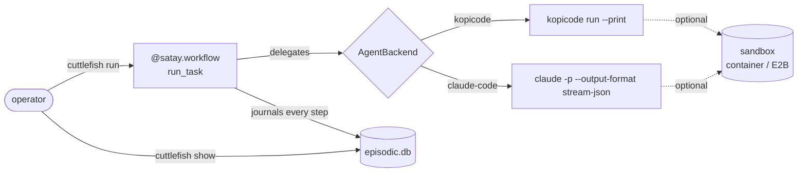

# cuttlefish-crew

A fleet manager for teams of coding sub-agents, running across many software
projects at once, so the operator stops babysitting a single agent's context
window and its own demos by hand.

Give a project's team a task in plain language. Each agent hands its coding
work to a pluggable backend — [kopicode](https://github.com/leejianrong/kopicode)
or headless Claude Code — rather than attempting the edit itself, and if the
process dies partway through, restarting it resumes from where it left off
instead of starting over: the core loop is a durable
[satay](https://github.com/leejianrong/satay-runtime) workflow, not an
ordinary function wrapped in durability later. Everything that happens is
written to one readable record, not scattered across logs that disagree
with each other.

> **Status**: the fleet-manager pivot is well underway — pluggable agent
> backends, project-scoped secrets, real team concurrency + steerable chat,
> a formal `Project` entity, a fleet daemon (`cuttlefish serve`) that runs
> every registered project's team concurrently, and a pixel-art dashboard
> (`frontend/`, `make demo`) are all complete. See [`CLAUDE.md`](CLAUDE.md)
> for exactly what's shipped and [`docs/PLAN.md`](docs/PLAN.md) for where
> this is headed.

## How it works



A killed process resumes exactly where it left off — nothing above the
journal is re-run, nothing below it is lost.

## Quick start

```bash
uv sync
uv run cuttlefish run "add a .gitignore entry for build artifacts"
uv run cuttlefish show <task-id>   # printed by `run`, above
```

`run` needs the configured backend's binary on `PATH` — `kopicode` by
default — checked before anything else (a missing one is a config error,
not a mid-task failure), plus a real model credential for that backend.
`CUTTLEFISH_LLM_PROVIDER=replay` swaps in a keyless, deterministic provider
for smoke-testing the CLI itself with no live credential.

### Try the dashboard

```bash
make demo
```

Builds the dashboard once, then runs `cuttlefish serve` alone -- one process
serves both the JSON API and the dashboard itself (ADR-0012), and prints one
URL to open with the token to paste into its connect screen. No daemon at
hand yet? The connect screen links straight to a sprite gallery that needs no
connection at all.

Reach it from another device on your [Tailscale](https://tailscale.com)
tailnet with `cuttlefish serve --tailscale` (needs `CUTTLEFISH_SERVE_PASSWORD`
set -- ADR-0011/ADR-0013). Keep it running across crashes/reboots with
`make install-systemd-service` (ADR-0014), a systemd `--user` unit with
`Restart=on-failure` -- reviews and prints the exact next commands, never
starts anything on its own.

## Usage

Declare which shell commands a delegation may run (default: none — only
edits inside `--root` are implicit):

```bash
uv run cuttlefish run "run the test suite" --allow "go test" --allow "npm test"
```

Run the same task against Claude Code instead of kopicode:

```bash
CUTTLEFISH_AGENT_BACKEND=claude-code uv run cuttlefish run "add a .gitignore entry"
```

Route the delegation through a container sandbox rather than the bare host:

```bash
CUTTLEFISH_SANDBOX=container uv run cuttlefish run "add a .gitignore entry"
```

Give one project its own, encrypted-at-rest secret and let a delegation read it:

```bash
export CUTTLEFISH_SECRETS_KEY=$(uv run cuttlefish secrets generate-key)
echo "hf_..." | uv run cuttlefish secrets set --project demo HUGGINGFACE_TOKEN
uv run cuttlefish run "..." --project demo --secret HUGGINGFACE_TOKEN
```

Run several named roles concurrently against one project, each independently
handed over and journaled under its own `role` tag:

```bash
uv run cuttlefish run-team \
  --role builder:"implement the login form" \
  --role reviewer:"review the last commit for style issues"
```

Roles sharing a kopicode-backed `--root` really do start concurrently, but
kopicode's own per-working-tree session lock means only one can actually edit
at a time today — a real, named gap, not silent corruption (see
`docs/adr/0007-...md`).

Redirect a still-running task from a second terminal (`--steerable` prints
the task id; `steer` reads a local pointer file to reach it):

```bash
uv run cuttlefish run --steerable "add a .gitignore entry"
# in another terminal, while the above is still running:
uv run cuttlefish steer <task-id> "actually add a .dockerignore instead"
```

A message takes effect at the boundary between delegation rounds, not
mid-flight — it waits for whatever round is currently running to finish
first (see `docs/adr/0008-...md` for why that's the honest limit, not a
missing feature). `run-team --steerable` works the same way, per role
(`cuttlefish steer <team-id> "<message>" --role NAME`).

Require sign-off before a round is ever treated as finished
(`--require-approval` in place of `--steerable`; `approve` in place of
`steer`) -- a formal review gate, not just an optional redirect (ADR-0016):

```bash
uv run cuttlefish run --require-approval "add a .gitignore entry"
# in another terminal, while the above is still running:
uv run cuttlefish approve <task-id>                                  # finalize it
uv run cuttlefish approve <task-id> --reject "use .dockerignore instead"  # one more round
```

## Configuration

| Variable | Default | What it does |
|---|---|---|
| `CUTTLEFISH_AGENT_BACKEND` | `kopicode` | Which coding-agent backend a delegation runs through: `kopicode` or `claude-code`. |
| `CUTTLEFISH_KOPICODE_BIN` | `kopicode` | Path to the kopicode binary, when that backend is selected. |
| `CUTTLEFISH_CLAUDE_CODE_BIN` | `claude` | Path to the Claude Code binary, when that backend is selected. |
| `CUTTLEFISH_LLM_PROVIDER` | `openrouter` | cuttlefish's own reasoning calls (handover summaries): `openrouter`, `claude`, or `replay` (keyless, for smoke tests). |
| `CUTTLEFISH_SANDBOX` | `none` | Real containment for the delegation: `none`, `container` (local Docker, no account needed), or `e2b`. |
| `CUTTLEFISH_SECRETS_KEY` | unset | Enables `cuttlefish.secrets.SecretsStore` (`cuttlefish secrets ...`, `run --project/--secret`). Unset means no project-scoped secrets store at all. |

A real run also needs a model credential for whichever LLM provider and
agent backend are selected (e.g. `OPENROUTER_API_KEY`, `ANTHROPIC_API_KEY`).

### Hosting (feasibility, not yet deployed)

A `Dockerfile` and `fly.toml.example` (ADR-0015) exist for a Fly.io-hosted
`cuttlefish serve` -- built and verified locally against a real Docker
daemon, never deployed to Fly's own service. One Fly app per tenant is the
recommended shape (see the ADR for why); rename `fly.toml.example` to
`fly.toml` and `fly launch`/`fly deploy` when you're ready to actually
provision one.

## Contributing

This repo is built by an AI coding agent under human supervision, one
PR-per-slice at a time. [`CLAUDE.md`](CLAUDE.md) is the actual contributor
guide — workflow conventions, toolchain commands, and the boundaries that
follow from this project's architectural decisions
([`docs/adr/`](docs/adr/)).

## The rest of the suite

- [kopicode](https://github.com/leejianrong/kopicode) — the reference coding
  specialist this project delegates to.
- [satay-runtime](https://github.com/leejianrong/satay-runtime) — the durable
  runtime this project's core loop is built on; its own roadmap now follows
  cuttlefish-crew's needs.
- [sibei-flow](https://github.com/leejianrong/sibei-flow) — auto-heals broken
  data pipelines; the sibling project whose hand-rolled transcript is the
  lesson this project's episodic journal is built to avoid repeating.
- [tingkat](https://github.com/leejianrong/tingkat) — a multi-LoRA routing
  benchmark, part of the same suite.

## Licence

Apache-2.0, matching every other repository in this suite. See [LICENSE](LICENSE).
