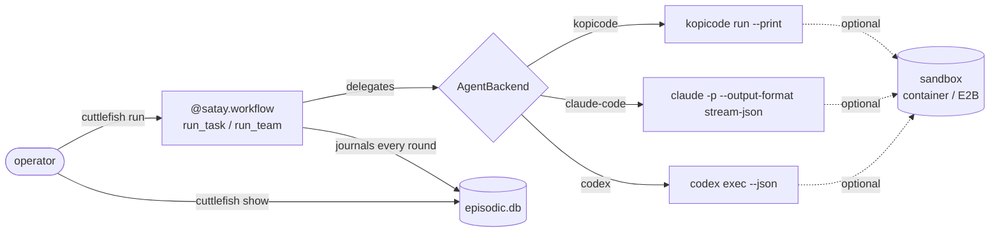

# Architecture

## The core loop: a durable workflow, not a wrapped function

Every task cuttlefish-crew runs is a [satay](https://github.com/leejianrong/satay-runtime)
workflow from the first commit that ran one at all — not an ordinary
Python function made durable as an afterthought. That single choice is why
a killed process resumes exactly where it left off: nothing above the
episodic journal is re-run, nothing below it is lost.

## One project, a small crew, one shared journal

A `Project` ([ADR-0009](https://github.com/leejianrong/cuttlefish-crew/blob/main/docs/adr/0009-a-project-is-a-registry-entry-and-the-fleet-daemon-runs-every-team-in-one-process.md))
is a stable identity — a registry entry (`~/.cuttlefish/projects.db`)
independent of any single directory's own `.cuttlefish/` — with a set of
named roles, each carrying its own persistent persona. `run_team`
([ADR-0007](https://github.com/leejianrong/cuttlefish-crew/blob/main/docs/adr/0007-a-team-is-concurrent-roles-sharing-one-task-id.md))
runs every role concurrently via `satay.gather`, sharing one task id and
one episodic journal, so the record of what a team did reads as one team's
work, not N unrelated log streams stitched together after the fact.

## The fleet daemon: every project's team, one process

`cuttlefish serve` ([ADR-0009](https://github.com/leejianrong/cuttlefish-crew/blob/main/docs/adr/0009-a-project-is-a-registry-entry-and-the-fleet-daemon-runs-every-team-in-one-process.md))
launches and owns every registered project's team concurrently, each as its
own `asyncio` task — no subprocess per project, no need for satay-runtime's
own multi-worker milestone. Each project gets a fully independent engine
and store (`satay.control.run_app(data_dir=<root>/.satay)`), coexisting as
plain `asyncio` tasks in one process. A loopback-only FastAPI surface
(`cuttlefish.fleet.server`) exposes list/start/stop/steer/approve/roles/
allow/budget per project; a Svelte + TypeScript + Vite dashboard
(`frontend/`) talks to it, rendering each role as a small animated
pixel-art sprite whose pose reflects its live status.

## The `AgentBackend` seam

`cuttlefish` never invents a shared wire protocol between the coding tools
it delegates to. Each `AgentBackend`
([ADR-0005](https://github.com/leejianrong/cuttlefish-crew/blob/main/docs/adr/0005-agent-backend-becomes-a-pluggable-protocol.md))
wraps its own tool's existing headless surface exactly as it exists —
kopicode's `run --print`, Claude Code's `claude -p --output-format
stream-json`, Codex's `codex exec --json` — and cuttlefish normalizes the
result on its own side (`DelegationOutcome`), never the other way around.
`CUTTLEFISH_AGENT_BACKEND` selects one per process; see
[ADR-0018](https://github.com/leejianrong/cuttlefish-crew/blob/main/docs/adr/0018-codex-is-a-third-agentbackend-with-its-own-honestly-named-gaps.md)
for what changed (and what didn't) proving the seam generalizes to a third
backend.

## Continuity, steering, and approval

A restarted daemon (`cuttlefish serve`) resumes each project's non-terminal
team by calling `satay.start` with its original `run_id`
([ADR-0010](https://github.com/leejianrong/cuttlefish-crew/blob/main/docs/adr/0010-continuity-is-a-cuttlefish-owned-resume-layer-satay-stays.md)),
rather than losing it or starting fresh; the round that was mid-flight
starts over. The one-shot CLI (`run`/`run-team`) does not resume by itself:
a plain rerun warns about unfinished runs and starts a new task, while
`--resume <id>` (with the original arguments repeated exactly) continues the old one. Steering
([ADR-0008](https://github.com/leejianrong/cuttlefish-crew/blob/main/docs/adr/0008-steering-is-a-round-boundary-redirect-not-a-mid-flight-interrupt.md))
and the round-boundary approval gate
([ADR-0016](https://github.com/leejianrong/cuttlefish-crew/blob/main/docs/adr/0016-round-boundary-approval-gate-replaces-steering-when-both-are-set.md))
both redirect or pause a team at the boundary between delegation rounds,
never mid-flight — neither backend's headless surface accepts input once a
round has started, so this is an honest architectural limit, not a gap
waiting to be closed.

## Remote access

Non-loopback binds get real password/session auth
([ADR-0011](https://github.com/leejianrong/cuttlefish-crew/blob/main/docs/adr/0011-non-loopback-serve-gets-its-own-login-session-layer-not-satays-token.md)),
the daemon can serve its own dashboard build same-origin
([ADR-0012](https://github.com/leejianrong/cuttlefish-crew/blob/main/docs/adr/0012-the-daemon-serves-its-own-dashboard-build-same-origin-static-shell.md)),
and `--tailscale` binds directly to your tailnet address
([ADR-0013](https://github.com/leejianrong/cuttlefish-crew/blob/main/docs/adr/0013-tailscale-mode-binds-direct-not-through-tailscale-serve.md)).
A systemd `--user` unit keeps the daemon running across crashes and reboots
([ADR-0014](https://github.com/leejianrong/cuttlefish-crew/blob/main/docs/adr/0014-a-systemd-user-unit-supervises-cuttlefish-serve.md)).
A `Dockerfile`/`fly.toml.example` exist for a hosted deployment
([ADR-0015](https://github.com/leejianrong/cuttlefish-crew/blob/main/docs/adr/0015-fly-io-hosting-is-feasible-one-app-per-tenant-single-machine.md))
— verified against a real local Docker daemon, not yet a live deployment.

The full decision history — every ADR, in order, with the reasoning and
trade-offs behind it — lives in
[`docs/adr/`](https://github.com/leejianrong/cuttlefish-crew/tree/main/docs/adr)
in the repository itself.
