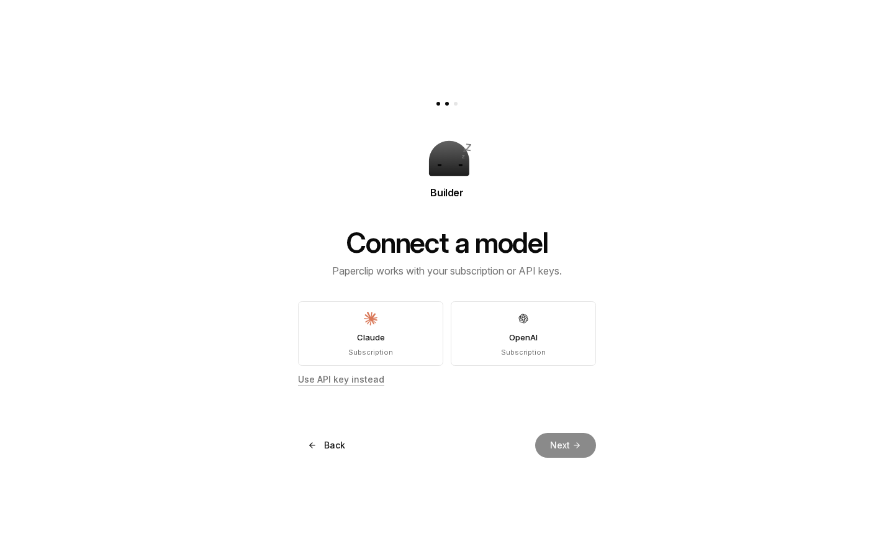
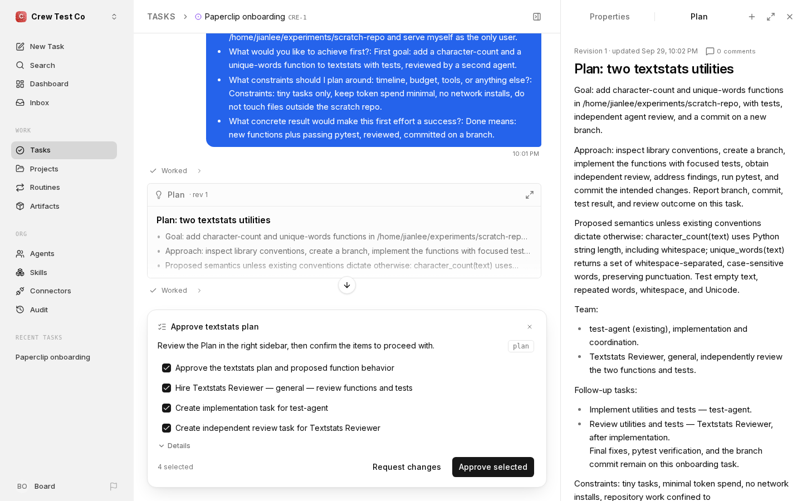
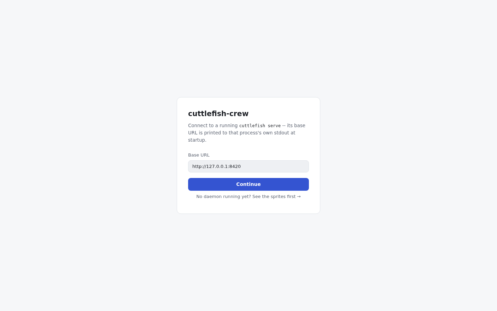
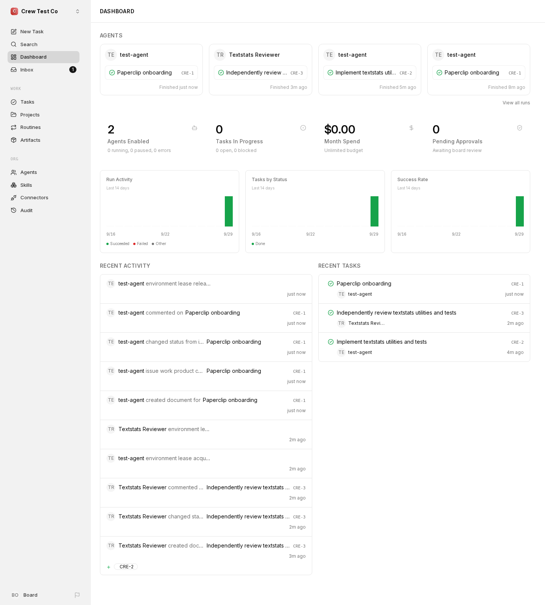
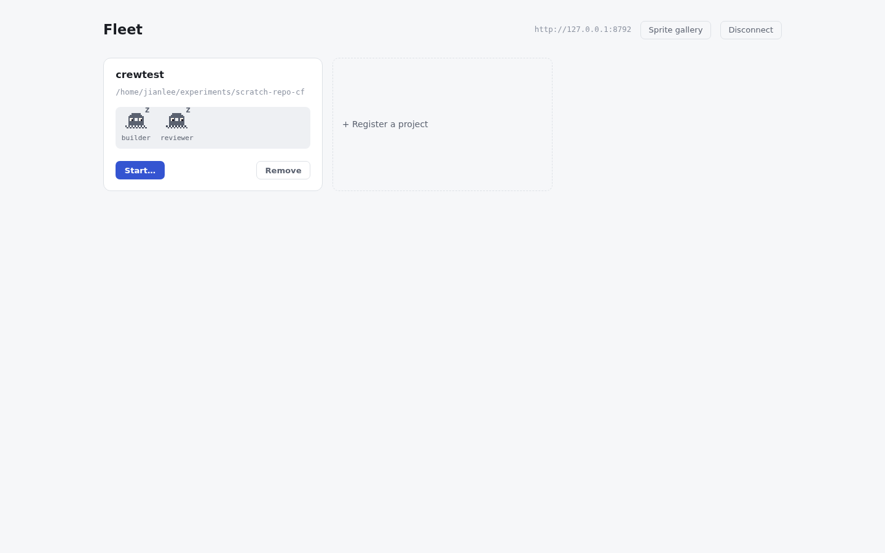

# Paperclip vs cuttlefish-crew: hands-on comparison (2026-09-29)

A first-hand comparison of onboarding, ergonomics, UI and capabilities, done
by actually installing and running both tools against the same tiny target
repo with the same agent (Codex, ChatGPT subscription). Raw notes:
`/home/jianlee/experiments/logs/notes.md` (not committed).

## Method and honest limits

- **Paperclip** `2026.916.1`, `npx paperclipai onboard --yes`, isolated
  `$HOME`, `local_trusted` mode, `codex_local` adapter.
- **cuttlefish-crew** at `main` (`108d452`), fresh clone, `uv sync`, isolated
  `$HOME`, `CUTTLEFISH_AGENT_BACKEND=codex`.
- Same throwaway repo (`textstats.py` + one test), same model/backend.
- Every wall-clock number is an **agent-speed** measurement (scripted browser,
  no reading time). A human would be slower on both; the *ratios* and the
  *count of steps/dead ends* are the meaningful signal, not the seconds.
- n = 1 operator, 1 machine, one afternoon. Nothing here says how either
  tool behaves at scale, under teams, or over weeks.
- The Paperclip model login step was completed by a human (browser sign-in);
  one exploratory click-through by the human happened before the scripted
  run. Task 8 (remote access) was compared from docs only, not run.
- I did not read either tool's credentials; cuttlefish used the operator's
  normal `~/.codex`, Paperclip its own managed login.

## Results at a glance

| # | Task | Paperclip | cuttlefish-crew |
|---|------|-----------|-----------------|
| 1 | Cold onboarding to a working agent | ~3 min to server up (npx download, 2.5 GB npm cache); 3-screen web wizard; 1 human terminal+browser login; agent-led interview starts automatically | 3.7 s `uv sync`; no wizard; 2 failed runs before the first success (see friction list); no guidance |
| 2 | Simple edit (2 functions + tests) | 10 tests, committed on a branch, via plan → task → review | 59 s, 133,925 tokens, 8 tests, uncommitted (asked not to commit) |
| 3 | Two agents on one project | Builder + independently hired reviewer, dependency-blocked tasks, honest review (flagged "no pytest, not a pytest pass") | 2 roles concurrently via `run-team`/daemon, ~90 s total; no automatic review workflow |
| 4 | Steer mid-run | Issue comment; honored after work was already committed (2nd commit undid it); ~4 min | `cuttlefish steer`; takes effect at the round boundary (68 s later), journaled `SteeringMessage`; 2 min 6 s total |
| 5 | Approval gate | Gates **before** work: plan approval + hire approval cards | Gates **after** a round: process blocks until `approve`; finalized in 6 s |
| 6 | Budget ceiling | 1-cent budget did **not** stop a run: subscription usage is `unpriced`, spend stays $0 | `--max-tokens 1000` blocked after the round (102,335 tokens used), released by `approve` |
| 7 | Kill -9 mid-run, recover | Restarts in 20 s, flags the run `interrupted/orphaned_running_run` after ~30 s, **no auto retry**, task left `in_progress` | CLI: rerun makes a **new** task, no resume. Daemon (`serve`): resumed same team in 4 s, both roles finished |
| 8 | Remote access | `authenticated` + `private`/`public` modes, Better Auth multi-user login, Tailscale/Fly/Docker documented | `serve --tailscale`, session password auth, Dockerfile + `fly.toml.example`; single operator (docs-only comparison) |

## Onboarding (measured)

**Paperclip** is genuinely good here. Three screens (org name, first agent
name, "Connect a model": Claude/OpenAI subscription or API key), then the
first agent posts a greeting card and offers "Interview me and propose a plan
and an agent team" or "I have a task". After four interview questions it
proposed a plan, a reviewer hire and two tasks, and asked for one approval.
You are in a conversation within minutes rather than at an empty dashboard.

Rough edges: the docs "5-minute path" never shows the install command (a
second page does; the README shows a different `curl | bash` route); the
wizard says "Step 1 of 4", then "Step 2 of 3" after a reload; Codex
subscription needs a separate device-auth login in an isolated home rather
than reusing the terminal login (safe, but an extra terminal step); a 2.5 GB
npm cache and ~1.3 GB RAM at startup.

**cuttlefish** installs in seconds but a new user hits, in order:

1. The README never says how to install `uv`, or `kopicode` (the default
   backend), or that Codex exists as a backend.
2. `CUTTLEFISH_AGENT_BACKEND=codex` still fails with
   `OPENROUTER_API_KEY is not set`. The only way out,
   `CUTTLEFISH_LLM_PROVIDER=replay`, is documented as a "smoke-test" switch.
   A subscription-only user is blocked with an error that doesn't say why.
3. An isolated `$HOME` hides Codex's login (`CODEX_HOME` error). Ordinary
   users won't hit this; it is noted only because it cost a run.
4. `--steerable` printed nothing when stdout was redirected to a file until
   the process exited (block-buffered; `PYTHONUNBUFFERED=1` fixes it).
5. State dirs (`.cuttlefish/`, `.satay/`) land in the current directory /
   the target repo root, not `$HOME`.

## Ergonomics and UI/UX

Scored 1–5 by me, with the evidence that drove each score. These are
judgments, not measurements.

| Dimension | Paperclip | cuttlefish | Why |
|-----------|:--:|:--:|-----|
| First-run guidance | 5 | 1 | Agent-led interview vs a bare CLI |
| Concept load before first task | 3 | 4 | Company/org/agents/issues/plan/approval vs projects+roles |
| Status legibility | 4 | 3 | Paperclip: issues, runs, activity feed, run transcripts. cuttlefish: sprites + journal, denser to read |
| Steering/approval loop | 4 | 3 | Both work; Paperclip's cards are richer, cuttlefish's block/approve is simpler and instant |
| Error clarity | 3 | 2 | cuttlefish's OpenRouter error is misleading for a Codex user; Paperclip's stale `running` agent after a crash is also misleading |
| Personality/brand | 2 | 4 | Neutral admin UI vs animated pixel crew; a taste call |
| Docs findability | 3 | 3 | Both have gaps (install command hidden vs prerequisites missing) |

## Capabilities

| Capability | Paperclip | cuttlefish |
|------------|-----------|------------|
| Backends | Claude, Codex, Gemini, HTTP adapter | kopicode, Claude Code, Codex (one per process) |
| Org model | Company, org chart, hiring, goals, routines | Projects and named roles |
| Multi-user / roles | Better Auth login (authenticated modes) | One shared password, no per-user roles |
| Connectors / plugins / skills | 62-page connector docs, plugin SDK, skills | MCP server (8 tools) |
| Durable execution | DB heartbeats; orphan **detection**, no auto resume | satay replay; daemon **resumes**; CLI doesn't |
| Audit trail | Activity feed, audit page, run transcripts | Episodic journal with per-tool-call events |
| Cost tracking | Per-run token fields, `unpriced` on subscription; dollar budgets can't bind subscription use | Tokens per round; dollars only when the backend reports them; token ceilings work |
| Footprint | ~1.3 GB RAM, embedded Postgres, 2.5 GB npm cache | Python process, SQLite, ~seconds |
| Hosted story | Fly/VPS/Docker docs; first-party "Cloud" emerging | Local Docker + `fly.toml.example`, never deployed |

## Bugs and doc mismatches found in *our* product

1. **Codex multi-file edits under-reported.** `_edited_path_from_item`
   (`src/cuttlefish/delegate/codex.py:259`) returns only the first path of a
   `file_change` item, so `DelegationCompleted.edited_paths` and the
   "Codex edited N file(s)" summary miss files (verified live in four runs).
2. **`cuttlefish run` does not resume after a crash** (`cli.py:144` always
   mints `uuid4()`). The README headline ("A killed process resumes exactly
   where it left off") and the CLAUDE.md statement that `run`/`run-team`
   resume are true only for the daemon path (`serve`).
3. **`OPENROUTER_API_KEY` required regardless of backend**, with no
   explanation.
4. **Usage shows `cost_usd: 0.0` for Codex** while the backend reports
   `None`; the UI implies "$0" instead of "unknown".
5. Budget ceilings are round-granular, so a huge first round overshoots any
   ceiling (102,335 tokens against a 1,000 ceiling).

## What to take from Paperclip

- **Agent-led first run.** The interview → plan → one approval flow is the
  best idea in either product. cuttlefish could offer a "first project"
  wizard or a `cuttlefish init` that registers a repo and proposes roles.
- **Approve the plan before spending tokens** (pre-work gate), not only
  after the round. Optional in cuttlefish would be a cheap addition.
- **A recovery signal**, even without auto-resume: Paperclip flags orphaned
  runs; cuttlefish should at least surface an unfinished CLI run instead of
  silently starting a new one.
- **Stale status after a crash** is a trap for any dashboard; check that
  cuttlefish's status never shows "working" for a dead run.

## Where cuttlefish already wins (measured, not claimed)

- Daemon crash recovery actually resumes work; Paperclip detects but leaves
  the task stuck.
- Token budget ceilings enforce on subscription-backed runs; Paperclip's
  dollar budget cannot.
- Much lighter to install: seconds and a small venv, against Paperclip's 2.5 GB npm cache and embedded Postgres (cuttlefish RAM was not measured).
- Per-tool-call journaling and a single readable record.

## Suggested next cards (not filed)

1. Fix Codex multi-file `edited_paths` (small, has a regression test shape).
2. Make `cuttlefish run` resume or at least warn about a non-terminal run;
   correct the README/CLAUDE.md wording either way.
3. Don't require `OPENROUTER_API_KEY` when the selected backend needs none
   of the supervisor LLM; otherwise say why it is needed.
4. `cuttlefish init` / first-run wizard (largest onboarding win).
5. Per-role/per-project backend selection (already a known gap).
6. Show `unknown` instead of `$0.00` for backends with no cost figure.
